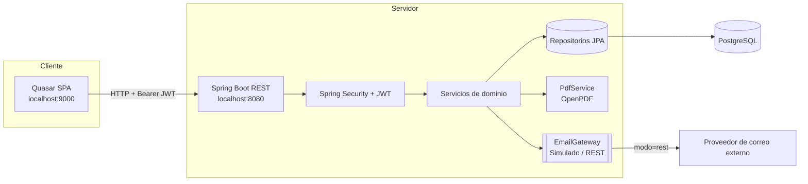
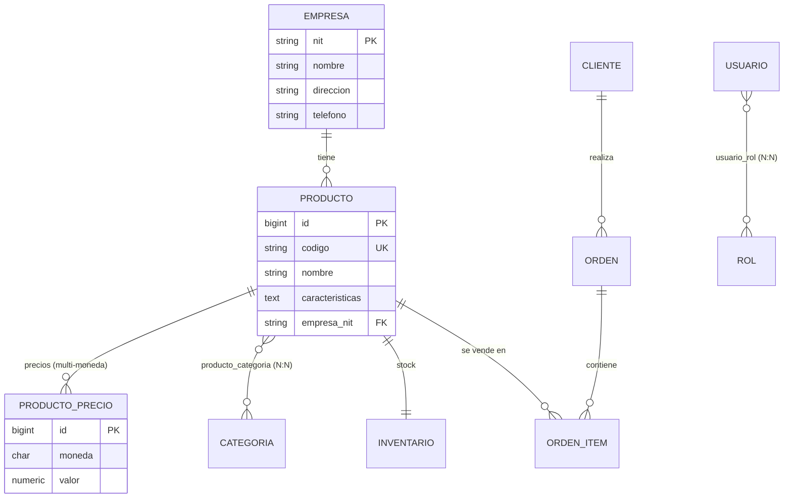

# Reto Práctico — Spring Boot + Quasar (Inventario)

Aplicación full‑stack para gestionar **empresas, productos (precios multi‑moneda),
categorías, clientes, órdenes e inventario**, con autenticación por **JWT**, roles
**ADMIN/EXTERNAL**, generación de **PDF** del inventario y **envío por correo** del
mismo a través de un proveedor externo (puerto/adaptador).

- **Backend:** Java 21 + Spring Boot 3.3 + Spring Security + JPA/Hibernate + Flyway + PostgreSQL.
- **Frontend:** Vue 3 + Quasar 2 (Vite) + Pinia + Axios + Vue Router.
- **Sin Docker / sin WSL / sin Kubernetes** — todo corre nativo en Windows.

---

## Tabla de contenido

1. [Arquitectura](#arquitectura)
2. [Modelo de datos](#modelo-de-datos)
3. [Requisitos previos](#requisitos-previos)
4. [Configuración de PostgreSQL](#configuración-de-postgresql)
5. [Ejecutar el backend](#ejecutar-el-backend)
6. [Ejecutar el frontend](#ejecutar-el-frontend)
7. [Credenciales demo](#credenciales-demo)
8. [Documentación de la API (Swagger)](#documentación-de-la-api-swagger)
9. [Pruebas](#pruebas)
10. [Despliegue en AWS](#despliegue-en-aws)
11. [Decisiones técnicas](#decisiones-técnicas)
12. [Seguridad](#seguridad)
13. [Uso responsable de IA](#uso-responsable-de-ia)
14. [Limitaciones y mejoras futuras](#limitaciones-y-mejoras-futuras)

---

## Arquitectura

Monolito **modular** organizado por funcionalidad (*package‑by‑feature*) y en capas
(`controller → service → repository`). Solo se usa **puertos/adaptadores** donde aporta
valor real: el envío de correo (`EmailGateway`) y la generación de PDF.



**Estructura del repositorio:**

```
RetoPracticoSpringBootQuasar/
├─ backend/                 # Spring Boot (Maven)
│  ├─ db/setup.sql          # Script de creación de BD/usuario
│  ├─ pom.xml
│  └─ src/main/...
├─ frontend/                # Quasar (Vue 3)
│  └─ src/...
└─ docs/plan.md             # Plan y justificación del enfoque
```

---

## Modelo de datos

Modelo entidad‑relación implementado con **Flyway** (migración `V1`). Claves: la
**empresa usa el NIT como PK natural**; producto ↔ categoría es **N:N**; cliente
1:N órdenes; orden ↔ producto **N:N** (a través de `orden_item`, que guarda el
precio como *snapshot*).



> El esquema lo gestiona Flyway. Hibernate se ejecuta en modo `ddl-auto=validate`:
> no crea ni altera tablas, solo verifica que las entidades coincidan con el esquema.

---

## Requisitos previos

| Herramienta | Versión usada | Notas |
|---|---|---|
| **JDK** | 21 (Temurin) | `java -version` |
| **Maven** | 3.9.x | Incluido vía `mvn`; o usa el wrapper |
| **PostgreSQL** | 17 | Instalación nativa en Windows |
| **Node.js** | 18/20/22 LTS recomendado | (Probado en 23; Quasar prefiere LTS par) |
| **npm** | 9+ | Viene con Node |

---

## Configuración de PostgreSQL

El backend usa dos bases: `reto_dev` (desarrollo) y `reto_test` (pruebas de
integración), y un usuario `reto_user`. Está todo en el script
[backend/db/setup.sql](backend/db/setup.sql).

Ejecútalo **una sola vez** (te pedirá la contraseña del superusuario `postgres`):

```powershell
# Agregar psql al PATH de esta sesión de PowerShell
$env:Path += ";C:\Program Files\PostgreSQL\17\bin"

# Ejecutar el script (crea usuario, las 2 bases y los permisos del esquema public)
psql -U postgres -h localhost -f backend/db/setup.sql
```

**Qué hace cada comando:**
- `$env:Path += ...` añade el `bin` de PostgreSQL al PATH **solo en esta terminal**.
- `psql -U postgres -h localhost -f <archivo>` conecta como `postgres` y ejecuta el
  SQL del archivo: `CREATE ROLE reto_user`, `CREATE DATABASE reto_dev/reto_test` y los
  `GRANT` necesarios (en PostgreSQL 15+ hay que conceder permisos sobre `public`
  explícitamente para que Flyway pueda crear las tablas).

---

## Ejecutar el backend

Desde la carpeta `backend/`:

```powershell
cd backend

# 1) Compilar y empaquetar (descarga dependencias, compila, deja el JAR en target/)
mvn clean package

# 2) Arrancar en modo desarrollo (perfil local por defecto)
mvn spring-boot:run

# Alternativa: ejecutar el JAR ya empaquetado
java -jar target/reto-inventario-0.0.1-SNAPSHOT.jar
```

**Qué hace cada comando Maven:**
- `clean` borra `target/` para partir de cero.
- `package` compila, ejecuta las pruebas y genera el JAR ejecutable
  (gracias al `spring-boot-maven-plugin`).
- `spring-boot:run` arranca la app sin empaquetar primero; ideal para desarrollar.
- Para **saltar las pruebas** al empaquetar: `mvn clean package -DskipTests`.

Al arrancar, Flyway aplica `V1` (esquema) y `V2` (datos demo) automáticamente.

- API: `http://localhost:8080`
- Salud: `http://localhost:8080/actuator/health`

**Perfiles** (variable `SPRING_PROFILES_ACTIVE`):
- `local` (por defecto): base `reto_dev`, correo **simulado** (solo log).
- `test`: base `reto_test`, usado por las pruebas de integración.
- `prod`: todo desde variables de entorno; correo **REST** real. Sin secretos en el repo.

---

## Ejecutar el frontend

Desde la carpeta `frontend/`:

```powershell
cd frontend

# 1) Instalar dependencias (solo la primera vez)
npm install

# 2) Servidor de desarrollo con recarga en caliente (http://localhost:9000)
npx quasar dev

# 3) Build de producción (genera dist/spa)
npx quasar build
```

**Qué hace cada comando:**
- `npm install` lee `package.json` e instala las dependencias en `node_modules/`.
- `quasar dev` levanta Vite con *hot reload* en el puerto **9000** (el mismo que el
  backend tiene permitido en CORS).
- `quasar build` genera la SPA optimizada en `frontend/dist/spa` (lista para subir a
  S3 + CloudFront).

> La URL del backend se controla con la variable de entorno `API_URL`
> (por defecto `http://localhost:8080`). Para apuntar a otra:
> `$env:API_URL="https://mi-api"; npx quasar build`.

---

## Credenciales demo

| Rol | Correo | Contraseña | Puede |
|---|---|---|---|
| **ADMIN** | `admin@reto.com` | `Admin123*` | CRUD empresas, registrar productos, inventario, PDF y envío por correo |
| **EXTERNAL** | `externo@reto.com` | `Externo123*` | Visualizar el listado de empresas (visitante) |

> Las contraseñas se guardan **hasheadas con BCrypt** (nunca en texto plano).

---

## Documentación de la API (Swagger)

Con el backend corriendo:

- Swagger UI: `http://localhost:8080/swagger-ui.html`
- OpenAPI JSON: `http://localhost:8080/v3/api-docs`

Para probar endpoints protegidos: haz `POST /api/auth/login`, copia el `token` y
pulsa **Authorize** en Swagger (`Bearer <token>`).

**Endpoints principales:**

| Método | Ruta | Acceso |
|---|---|---|
| POST | `/api/auth/login` | Público |
| GET | `/api/empresas` | Público |
| POST/PUT/DELETE | `/api/empresas/**` | ADMIN |
| GET | `/api/productos?empresaNit=` | Autenticado |
| POST/PUT/DELETE | `/api/productos/**` | ADMIN |
| GET | `/api/inventario` | ADMIN |
| GET | `/api/inventario/pdf` | ADMIN |
| POST | `/api/inventario/enviar` | ADMIN |

---

## Pruebas

Las pruebas de integración corren contra la base **`reto_test`** (perfil `test`),
sin contenedores.

```powershell
cd backend
mvn test
```

- `mvn test` compila y ejecuta la fase de pruebas. Si quieres solo empaquetar sin
  pruebas: `mvn clean package -DskipTests`.

---

## Despliegue en AWS

Región objetivo: **us‑east‑1**. Sin Docker (JAR sobre la plataforma Java de
Elastic Beanstalk).

- **Backend:** AWS Elastic Beanstalk (plataforma *Corretto/Java 21*), desplegando el
  JAR de `mvn clean package`.
- **Base de datos:** Amazon RDS (PostgreSQL).
- **Frontend:** `quasar build` → bucket S3 + distribución CloudFront.
- **Secretos:** AWS Systems Manager **Parameter Store** / **Secrets Manager**,
  inyectados como variables de entorno en Beanstalk.
- **Logs:** Amazon CloudWatch.

**Variables de entorno requeridas en prod** (ninguna va al repo):

```
SPRING_PROFILES_ACTIVE=prod
DB_URL=jdbc:postgresql://<rds-endpoint>:5432/<db>
DB_USERNAME=...
DB_PASSWORD=...
APP_JWT_SECRET=<cadena de 32+ caracteres>
APP_EMAIL_REMITENTE=...
APP_EMAIL_API_URL=...
APP_EMAIL_API_KEY=...
APP_CORS_ORIGINS=https://<dominio-cloudfront>
```

---

## Decisiones técnicas

- **Monolito modular** en vez de microservicios: el alcance no justifica la
  complejidad operativa (red, despliegues, observabilidad) de microservicios,
  Kubernetes, Kafka, CQRS o Event Sourcing. Un monolito bien modularizado es más
  simple de operar y se puede dividir después si hiciera falta.
- **Flyway** para el esquema (versionado y reproducible) + `ddl-auto=validate`:
  Hibernate nunca modifica la base; solo valida.
- **JWT stateless (HS256):** el servidor no guarda sesión; el token lleva correo y
  roles firmados. Escala horizontalmente sin estado compartido.
- **DTOs (records) + mappers manuales:** controlo exactamente qué se serializa y
  evito exponer entidades JPA y sus relaciones perezosas.
- **OpenPDF** (LGPL/MPL) en lugar de iText 7 (AGPL/comercial): licencia compatible
  sin coste.
- **Precios multi‑moneda** en tabla aparte (`producto_precio`) con `NUMERIC(15,2)`
  para no perder precisión monetaria.
- **Puerto/adaptador solo para correo y PDF:** abstracciones donde aportan valor
  (hoy `simulado`, en prod `rest`), sin sobre‑ingeniería en el resto del código.

---

## Seguridad

- Contraseñas con **BCrypt** (sal incluida; irreversibles).
- **Sin secretos en el repositorio**: en prod todo viene de variables de entorno /
  Secrets Manager.
- Autorización por **roles** con `@PreAuthorize` y un *guard* en el router del
  frontend (la UI oculta lo que el backend igualmente protege).
- **CORS** restringido al origen del frontend.
- Manejo central de errores (`@RestControllerAdvice`) sin filtrar detalles internos.

---

## Uso responsable de IA

Parte del código y la documentación se generaron con asistencia de IA, **revisando y
entendiendo** cada componente. Los comentarios en español del código explican el *por
qué* de cada decisión con fines de aprendizaje. No se incluyeron datos reales ni
secretos; las credenciales demo son ficticias y de un solo uso.

---

## Limitaciones y mejoras futuras

- El adaptador de correo `rest` está listo pero requiere configurar un proveedor real.
- Falta paginación/filtrado avanzado en algunos listados.
- Cobertura de pruebas ampliable (más casos de integración y E2E del frontend).
- Posible incorporación de refresh tokens y expiración deslizante.
- Internacionalización (i18n) del frontend.
```
